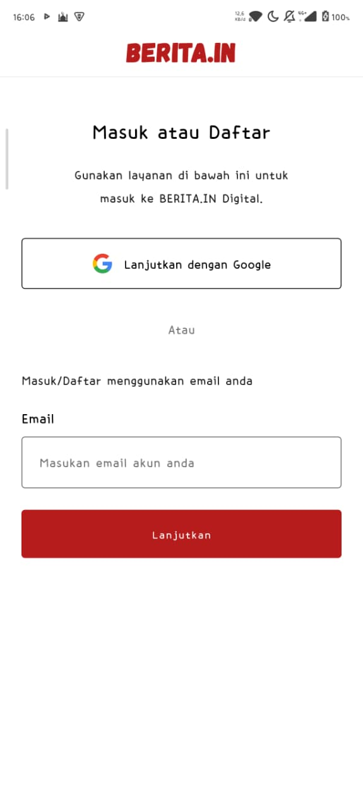
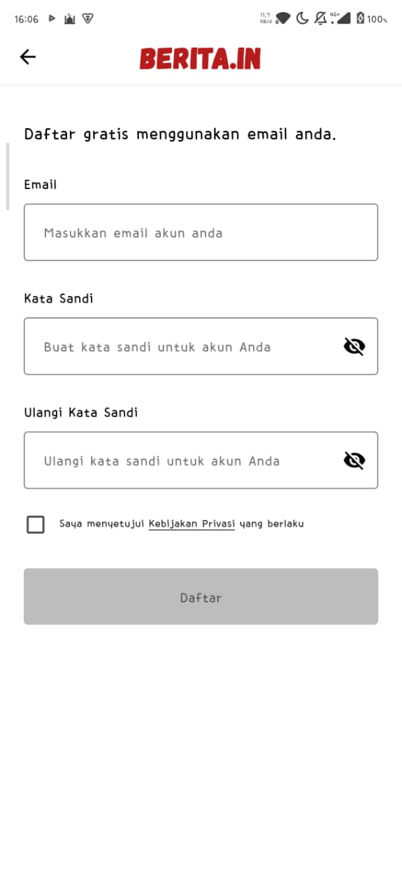
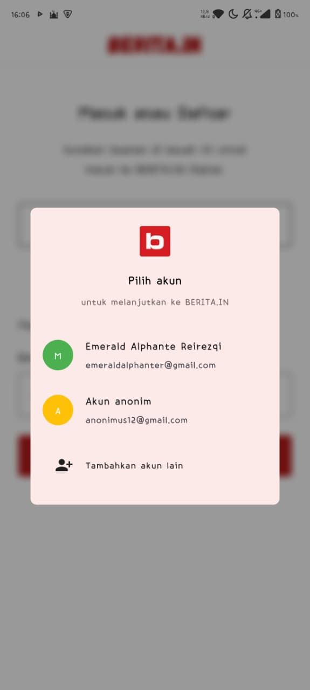
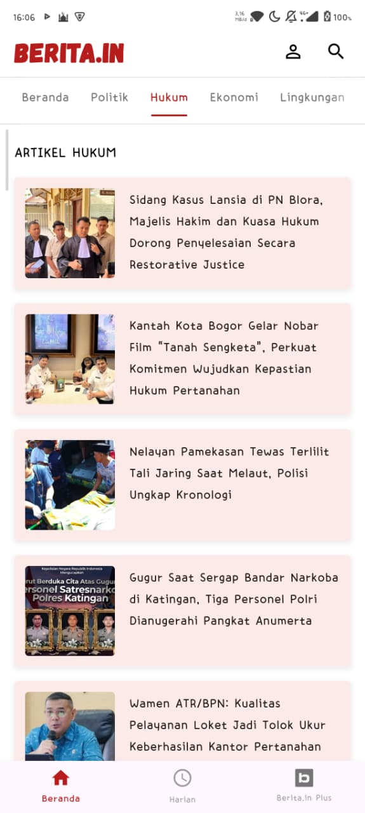
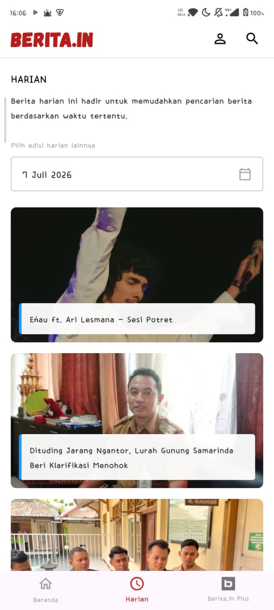
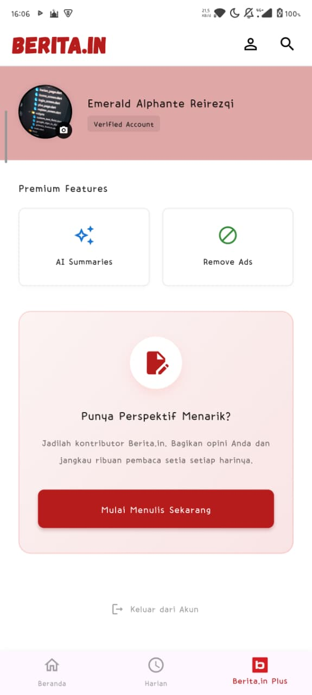

# BERITA.IN - Mobile Computing App

Aplikasi berita digital komprehensif yang dikembangkan menggunakan Flutter.

## 🔗 Tautan Desain
**Figma Design:** [Akses Desain Figma BERITA.IN](https://www.figma.com/design/8HtUj97GvAGqRKqwtyTNcr/BERITA.IN?node-id=0-1&p=f&t=G5vPJmMBo0ruyNuy-0)

## ✨ Fitur Utama
* **Integrasi REST API:** Menarik dan menampilkan data berita secara *real-time* langsung dari server.
* **State Management:** Pengelolaan status dan aliran data aplikasi yang terstruktur menggunakan arsitektur MVVM dan `Provider`.
* **Local Storage:** Menggunakan `SharedPreferences` untuk mengelola status *login*, menyimpan *email* pengguna, dan menjaga sesi autentikasi.
* **Mobile Feature (Kamera):** Integrasi *hardware* kamera ponsel (`image_picker`) untuk menangkap dan memperbarui foto profil pada menu Berita.in Plus.
* **Autentikasi Terpadu:** Halaman Login dan Register dengan validasi *form* interaktif, dilengkapi dialog kustom untuk simulasi *Google Sign-In*.
* **Navigasi & UI Dinamis:** *Bottom Navigation Bar* dengan transisi ikon kustom interaktif, sistem kategori horizontal dengan *fade gradient*, dan pencarian arsip berita harian menggunakan kalender (`showDatePicker`).

## 📱 Tangkapan Layar (Screenshots)
Berikut adalah hasil implementasi antarmuka aplikasi Berita.in:

### 1. Autentikasi Pengguna
| Halaman Login | Halaman Register | Popup Sign-In |
| :---: | :---: | :---: |
|  |  |  |

### 2. Fitur Utama & Navigasi
| Halaman Beranda | Halaman Harian | Berita.in Plus |
| :---: | :---: | :---: |
|  |  |  |

## 📂 Struktur Direktori Utama (Arsitektur MVVM)
Proyek ini mengimplementasikan pemisahan tanggung jawab (*Separation of Concerns*) yang ketat:
* `lib/models/` - Representasi struktur data (contoh: model artikel berita).
* `lib/viewmodels/` - Logika bisnis yang menjembatani data dan UI (menggunakan `Provider`).
* `lib/services/` - Lapisan komunikasi eksternal (API *Service* dan *Auth/Storage Service*).
* `lib/views/` - Seluruh *file* UI halaman utama aplikasi (Login, Register, Home, Harian, Plus).
* `lib/widgets/` - Komponen UI mandiri (*reusable*), seperti dialog *sign-in*, tombol, dan *text field*.
* `lib/theme/` - Pengaturan palet warna utama dan *styling* global aplikasi.
* `assets/` - Penyimpanan aset visual seperti *custom font* (Gagalin) dan gambar/vektor.

---
*Dibuat oleh Emerald Alphante Reirezqi | Universitas Cakrawala - Data Science*